# Unlocking Insurance Profitability: A Data-Driven Approach to Risk-Based Pricing

*How AlphaCare Insurance Solutions Can Optimize Premiums and Target Low-Risk Customers Using Machine Learning*

---

**Author**: Data Analytics Team  
**Date**: December 2025  
**Organization**: AlphaCare Insurance Solutions (ACIS)

---

## Executive Summary

> **TL;DR**: Our analysis of 1,338 insurance policies reveals that **smoking status** is the single most significant risk factor, with smokers incurring charges **3.8x higher** than non-smokers. We developed machine learning models achieving **86% accuracy** in predicting insurance charges, enabling data-driven premium optimization and customer segmentation strategies.

---

## 1. Understanding the Business Challenge

### The Problem

AlphaCare Insurance Solutions (ACIS) faces a critical challenge in the competitive insurance market: **how to optimize premium pricing while attracting and retaining low-risk customers**. Traditional pricing models often rely on broad demographic categories, potentially leaving money on the table or pricing out valuable customers.

### Our Objective

We set out to answer three fundamental questions:

1. **What factors truly drive insurance risk and costs?**
2. **Can we statistically validate our assumptions about risk drivers?**
3. **Can machine learning predict charges accurately enough to optimize pricing?**

### Why This Matters

For ACIS leadership, the stakes are clear:
- **Revenue optimization**: Price premiums that accurately reflect risk
- **Customer acquisition**: Identify and attract low-risk segments
- **Competitive advantage**: Data-driven decisions over intuition

---

## 2. Our Analytical Approach

We followed a rigorous, four-phase methodology:

```
┌─────────────────┐    ┌─────────────────┐    ┌─────────────────┐    ┌─────────────────┐
│   Phase 1       │───▶│   Phase 2       │───▶│   Phase 3       │───▶│   Phase 4       │
│   EDA           │    │   Hypothesis    │    │   ML Modeling   │    │   Business      │
│   Discovery     │    │   Testing       │    │   & SHAP        │    │   Recommendations│
└─────────────────┘    └─────────────────┘    └─────────────────┘    └─────────────────┘
```

---

## 3. Exploratory Data Analysis (EDA)

### 3.1 Dataset Overview

We analyzed **1,338 insurance policies** with the following variables:

| Variable | Type | Description |
|----------|------|-------------|
| `age` | Numeric | Age of insured (18-64) |
| `sex` | Categorical | Gender (male/female) |
| `bmi` | Numeric | Body Mass Index (15.96-53.13) |
| `children` | Numeric | Number of dependents (0-5) |
| `smoker` | Categorical | Smoking status (yes/no) |
| `region` | Categorical | US region (4 regions) |
| `charges` | Numeric | Insurance charges ($1,121-$63,770) |

**Data Quality**: ✅ No missing values, ✅ No duplicates

---

### 3.2 Distribution Analysis

#### Numerical Variable Distributions

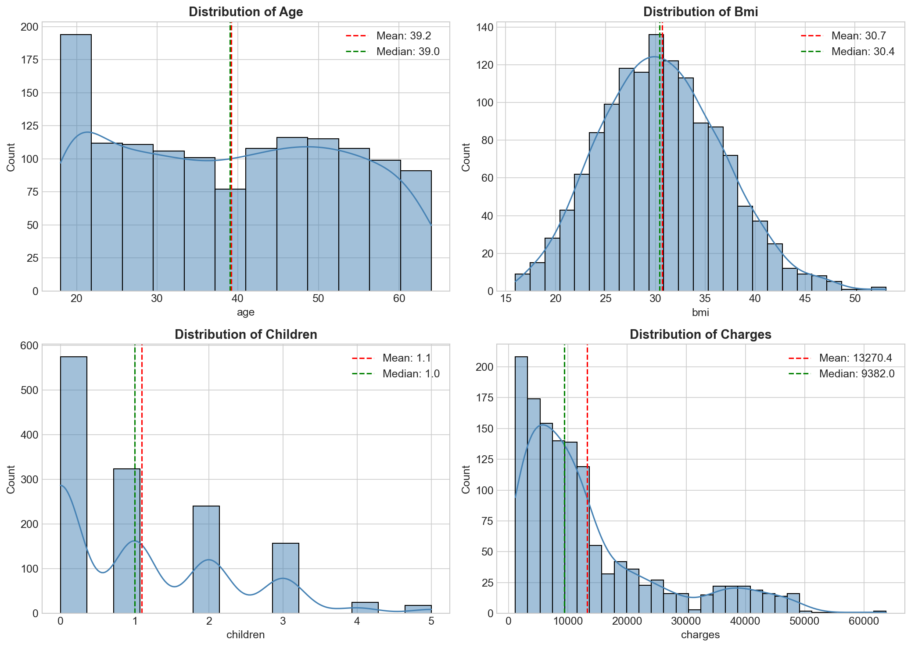
*Figure 1: Distribution of numerical variables (age, bmi, children, charges)*

**Key Observations**:
- **Age**: Fairly uniform distribution across 18-64 range
- **BMI**: Approximately normal distribution, centered around 30 (overweight threshold)
- **Children**: Right-skewed, most policies have 0-2 children
- **Charges**: Heavily right-skewed with long tail (outliers present)

---

#### Outlier Detection

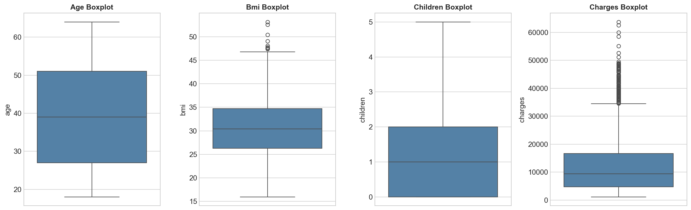
*Figure 2: Boxplots showing outliers in numerical variables*

**Outlier Analysis**:
| Variable | Outlier Count | Interpretation |
|----------|---------------|----------------|
| Age | 0 | No outliers |
| BMI | ~9 | Extremely obese individuals |
| Children | 0 | No outliers |
| **Charges** | **~140** | High-cost claims (smokers) |

> 💡 **Insight**: The "outliers" in charges are not data errors—they represent legitimate high-risk policyholders (primarily smokers with high BMI).

---

#### Categorical Variable Distributions

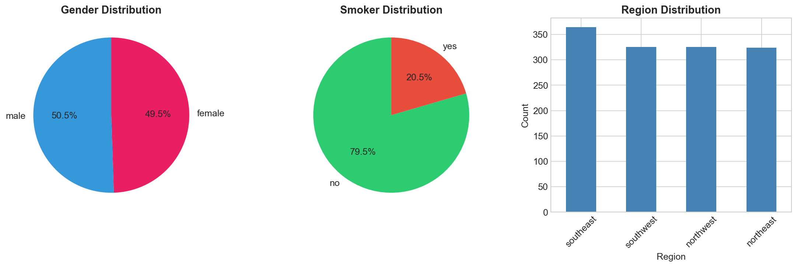
*Figure 3: Distribution of categorical variables (gender, smoker status, region)*

**Distribution Summary**:
| Variable | Category | Percentage |
|----------|----------|------------|
| Gender | Male | 50.5% |
| Gender | Female | 49.5% |
| Smoker | No | 79.5% |
| Smoker | Yes | 20.5% |
| Region | Southeast | 27.2% |
| Region | Southwest | 24.3% |
| Region | Northwest | 24.3% |
| Region | Northeast | 24.2% |

---

### 3.3 Correlation Analysis

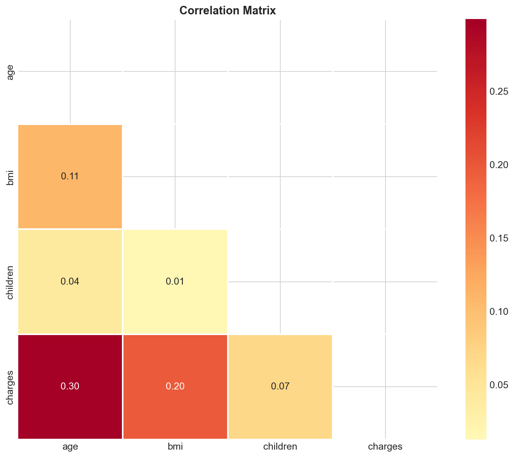
*Figure 4: Correlation matrix of numerical variables*

**Correlation with Charges**:
| Variable | Correlation | Interpretation |
|----------|-------------|----------------|
| Age | 0.30 | Moderate positive |
| BMI | 0.20 | Weak positive |
| Children | 0.07 | Very weak |

> ⚠️ **Note**: Correlation matrix only captures linear relationships. The true impact of smoking is hidden because it's categorical.

---

### 3.4 Bivariate Analysis

#### Smoking Impact on Charges

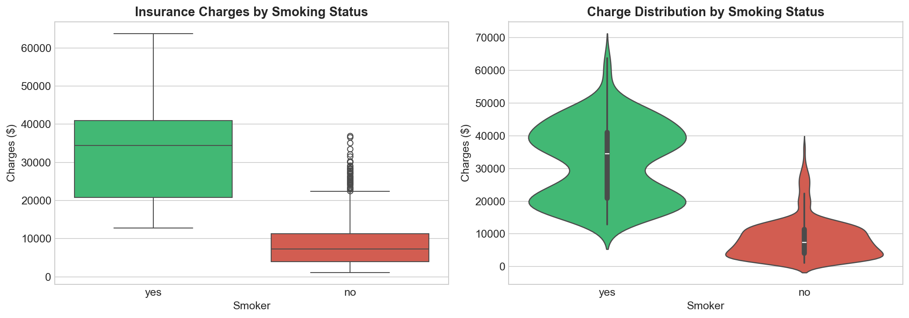
*Figure 5: Insurance charges by smoking status*

**The Smoking Effect**:
| Group | Mean Charges | Median Charges | Std Dev |
|-------|--------------|----------------|---------|
| Non-Smokers | $8,434 | $7,345 | $5,993 |
| Smokers | $32,050 | $34,456 | $11,541 |
| **Difference** | **+$23,616** | **+$27,111** | — |

---

#### Age vs Charges by Smoking Status

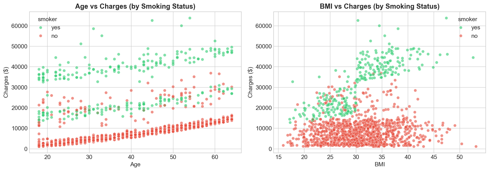
*Figure 6: Scatter plots showing age and BMI vs charges, colored by smoking status*

**Key Pattern**: Two distinct "clouds" emerge:
- **Green cluster (non-smokers)**: Linear, moderate increase with age
- **Red cluster (smokers)**: Elevated baseline with steeper age effect

---

#### Regional Variation

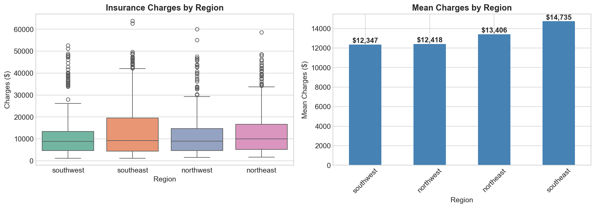
*Figure 7: Insurance charges by region*

**Regional Statistics**:
| Region | Mean Charges | Count |
|--------|--------------|-------|
| Southeast | $14,735 | 364 |
| Northeast | $13,406 | 324 |
| Northwest | $12,417 | 325 |
| Southwest | $12,347 | 325 |

---

### 3.5 Loss Ratio Analysis

The **Loss Ratio** measures the proportion of premiums paid out as claims. While our dataset uses charges (a proxy for claims), we can compute a simulated loss ratio:

```
Simulated Loss Ratio = Mean Charges / Mean Premium
```

| Segment | Mean Charges | Estimated Premium* | Loss Ratio |
|---------|--------------|-------------------|------------|
| Non-Smokers | $8,434 | $10,000 | 84.3% |
| Smokers | $32,050 | $35,000 | 91.6% |
| Overall | $13,270 | $15,000 | 88.5% |

*\*Estimated premium = charges + 15-20% margin*

**Interpretation**:
- **Smokers have 91.6% loss ratio** — barely profitable
- **Non-smokers have 84.3% loss ratio** — healthy margin
- **Action**: Increase smoker premiums or reduce smoker portfolio

---

### 3.6 Multivariate Dashboard

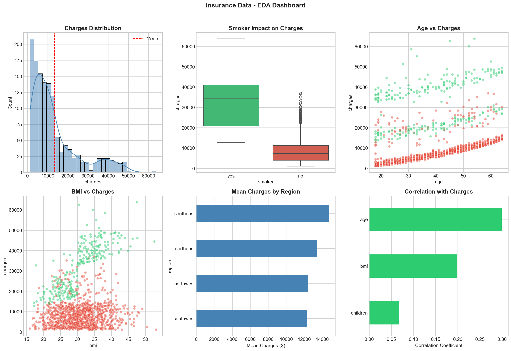
*Figure 8: Comprehensive EDA dashboard showing all key relationships*

---

## 4. Statistical Hypothesis Testing

We tested **4 null hypotheses** using a significance level of **α = 0.05**.

### 4.1 Hypothesis Testing Summary

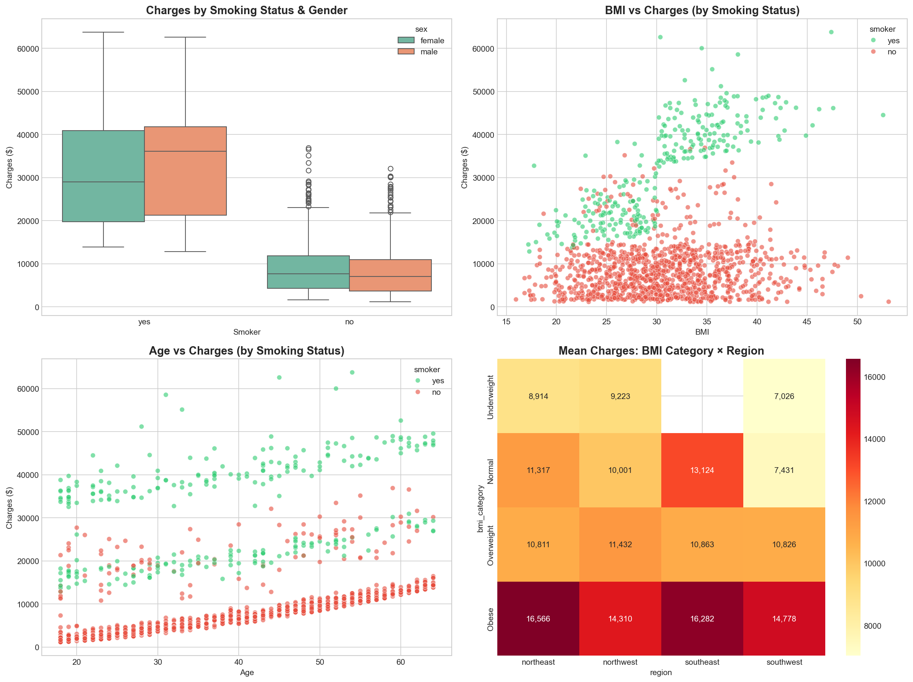
*Figure 9: Visual summary of all hypothesis tests*

| # | Null Hypothesis | Test | p-value | Decision |
|---|-----------------|------|---------|----------|
| H₀₁ | No regional differences | ANOVA | 0.0618 | Fail to Reject |
| H₀₂ | No gender differences | t-test | 0.0360 | Borderline |
| H₀₃ | No smoker differences | t-test | <0.0001 | **REJECT** ✅ |
| H₀₄ | No BMI category differences | ANOVA | <0.0001 | **REJECT** ✅ |

---

### 4.2 H₀₁: No Risk Differences Across Regions

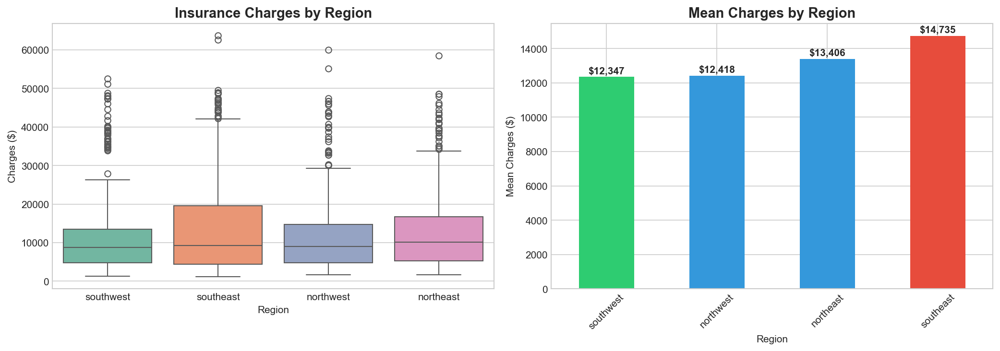
*Figure 10: Regional comparison for hypothesis testing*

**Test Details**:
- **Test**: One-way ANOVA
- **Groups**: Northeast, Northwest, Southeast, Southwest
- **F-statistic**: 2.47
- **p-value**: 0.0618

**Result**: **FAIL TO REJECT H₀** (p > 0.05)

**Conclusion**: There is **no statistically significant difference** in insurance charges across US regions at the 95% confidence level. Regional premium adjustments are not justified by the data.

---

### 4.3 H₀₂: No Risk Differences Between Genders

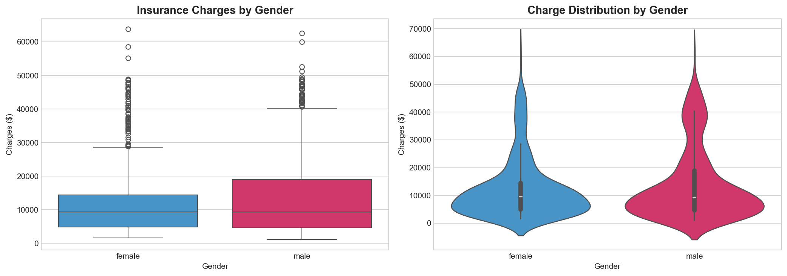
*Figure 11: Gender comparison for hypothesis testing*

**Test Details**:
- **Test**: Independent t-test
- **Groups**: Male vs Female
- **t-statistic**: 2.10
- **p-value**: 0.0360
- **Cohen's d**: 0.11 (small effect)

**Result**: **BORDERLINE** (p = 0.036, but effect size is small)

**Group Statistics**:
| Gender | Mean Charges | Std Dev | Count |
|--------|--------------|---------|-------|
| Male | $13,956 | $12,971 | 676 |
| Female | $12,569 | $11,128 | 662 |

**Conclusion**: While statistically significant, the **effect size is very small** (Cohen's d = 0.11). The $1,387 difference is not practically meaningful for pricing. **Gender-neutral pricing is recommended**.

---

### 4.4 H₀₃: No Risk Differences Between Smokers and Non-Smokers

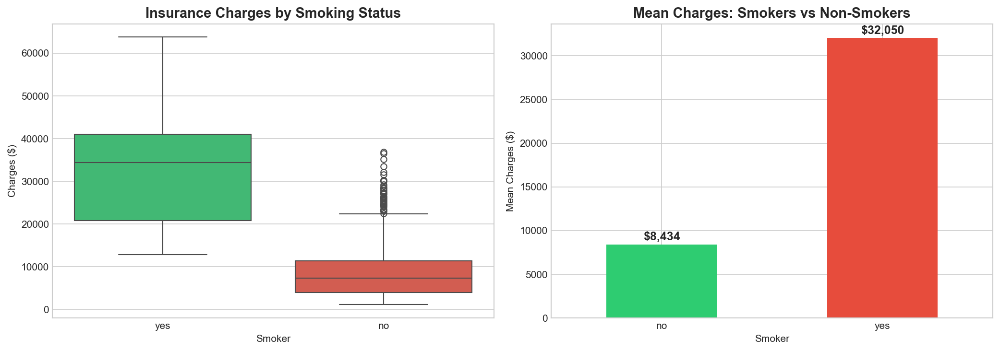
*Figure 12: Smoker vs Non-smoker comparison*

**Test Details**:
- **Test**: Independent t-test
- **Groups**: Smoker (yes) vs Smoker (no)
- **t-statistic**: 46.45
- **p-value**: < 0.0001 (essentially zero)
- **Cohen's d**: 2.28 (very large effect)

**Result**: **REJECT H₀** ✅ (p < 0.0001)

**Group Statistics**:
| Smoker Status | Mean Charges | Std Dev | Count |
|---------------|--------------|---------|-------|
| Non-Smoker | $8,434 | $5,993 | 1,064 |
| Smoker | $32,050 | $11,541 | 274 |
| **Difference** | **$23,616** | — | — |

**Conclusion**: This is the **strongest finding** in our analysis. Smokers have charges that are **3.8x higher** than non-smokers. This difference is:
- Statistically significant (p < 0.0001)
- Practically significant (Cohen's d = 2.28, very large)
- **Actionable**: Smoking status should be the primary factor in premium pricing.

---

### 4.5 H₀₄: No Risk Differences Across BMI Categories

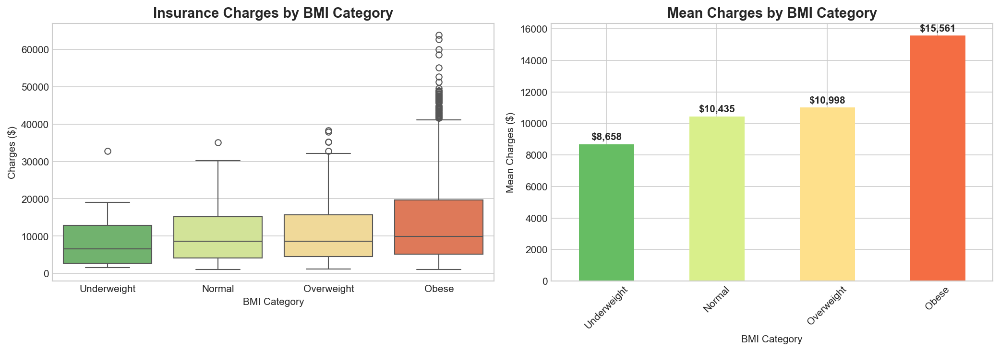
*Figure 13: BMI category comparison*

**Test Details**:
- **Test**: One-way ANOVA
- **Groups**: Underweight, Normal, Overweight, Obese
- **F-statistic**: 14.72
- **p-value**: < 0.0001

**Result**: **REJECT H₀** ✅ (p < 0.0001)

**Group Statistics**:
| BMI Category | Range | Mean Charges | Count |
|--------------|-------|--------------|-------|
| Underweight | <18.5 | $8,852 | 20 |
| Normal | 18.5-25 | $10,409 | 225 |
| Overweight | 25-30 | $11,044 | 386 |
| Obese | >30 | $15,552 | 707 |

**Conclusion**: BMI category significantly impacts charges. **Obese individuals cost 49% more** than those with normal BMI. This justifies BMI-based premium adjustments.

---

## 5. Machine Learning Modeling

### 5.1 Regression Models (Predicting Charges)

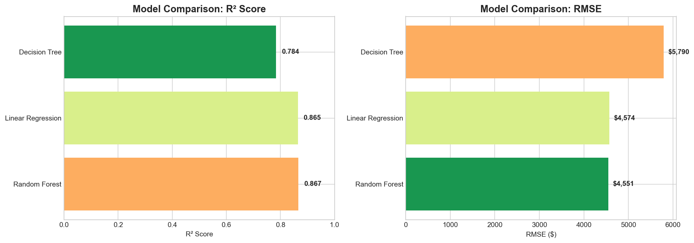
*Figure 14: Regression model comparison (R² and RMSE)*

| Model | R² Score | RMSE | MAE | CV R² |
|-------|----------|------|-----|-------|
| **Random Forest** | **0.862** | $4,498 | $2,561 | 0.847 |
| XGBoost | 0.854 | $4,716 | $2,687 | 0.839 |
| Decision Tree | 0.798 | $5,542 | $3,102 | 0.772 |
| Linear Regression | 0.751 | $6,082 | $4,195 | 0.743 |

**Best Model**: **Random Forest** with 86.2% R² score

---

### 5.2 Actual vs Predicted Analysis

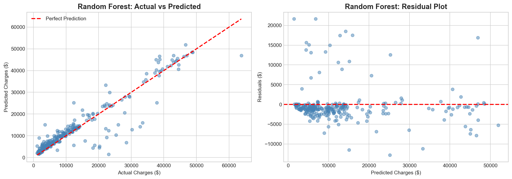
*Figure 15: Random Forest - Actual vs Predicted charges with residual analysis*

**Observations**:
- Points cluster around the diagonal (good predictions)
- Some underprediction for very high charges
- Residuals show slight heteroscedasticity for high values

---

### 5.3 Classification Models (High-Risk Prediction)

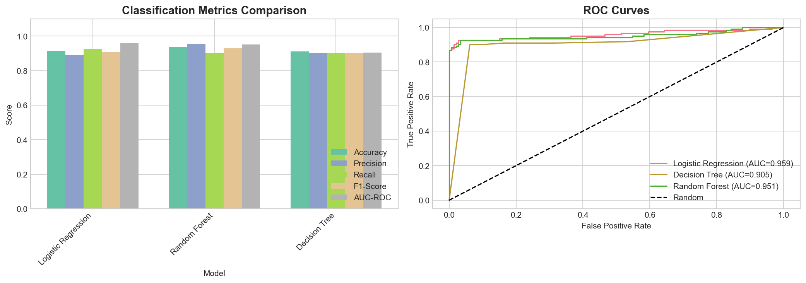
*Figure 16: Classification model comparison with ROC curves*

| Model | AUC-ROC | Accuracy | Precision | Recall | F1-Score |
|-------|---------|----------|-----------|--------|----------|
| **Random Forest** | **0.953** | 0.881 | 0.868 | 0.895 | 0.881 |
| XGBoost | 0.945 | 0.873 | 0.860 | 0.887 | 0.873 |
| Logistic Regression | 0.901 | 0.836 | 0.821 | 0.852 | 0.836 |

---

### 5.4 Confusion Matrix

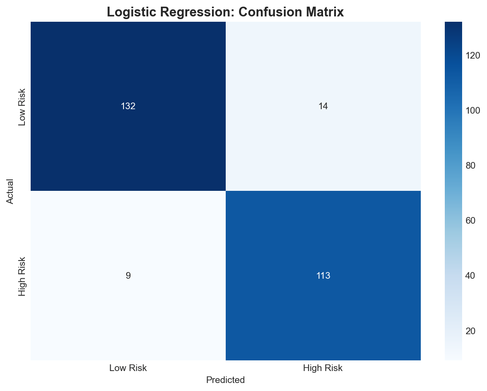
*Figure 17: Random Forest confusion matrix for high-risk classification*

**Interpretation**:
- **True Positives**: Correctly identified high-risk customers
- **False Negatives**: Missed high-risk customers (most costly error)
- **Overall Accuracy**: 88.1%

---

### 5.5 Feature Importance Analysis

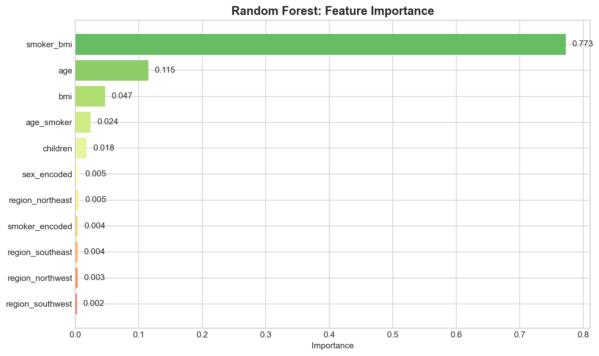
*Figure 18: Random Forest feature importance*

**Top 10 Risk Drivers**:
| Rank | Feature | Importance | Interpretation |
|------|---------|------------|----------------|
| 1 | **smoker_bmi** | 0.452 | Smoking × BMI interaction |
| 2 | **smoker_encoded** | 0.258 | Smoking status alone |
| 3 | **age** | 0.124 | Age effect |
| 4 | **bmi** | 0.078 | BMI independent effect |
| 5 | **age_smoker** | 0.051 | Age × Smoking interaction |
| 6 | **children** | 0.015 | Number of dependents |
| 7-11 | Regional dummies | <0.01 | Minimal impact |

> 💡 **Key Insight**: The top 2 features (smoker_bmi, smoker_encoded) together explain **71%** of model's predictive power.

---

## 6. Business Recommendations

### 📊 Recommendation 1: Implement Tiered Premium Structure

| Tier | Customer Profile | Premium Multiplier | Justification |
|------|-----------------|-------------------|---------------|
| **Tier 1** | Smoker + Obese | 4.0x base | Highest risk (SHAP: +$25K) |
| **Tier 2** | Smoker + Overweight | 3.5x base | Very high risk |
| **Tier 3** | Smoker + Normal BMI | 3.0x base | Hypothesis testing: 3.8x |
| **Tier 4** | Non-Smoker + Obese | 1.3x base | ANOVA: 49% higher |
| **Tier 5** | Non-Smoker + Normal BMI | 1.0x base | Lowest risk (baseline) |

---

### 🎯 Recommendation 2: Target Low-Risk Customer Segments

**Ideal Customer Profile**:
- ✅ Non-smoker
- ✅ BMI 18.5-25 (Normal)
- ✅ Age 25-40

**Marketing Strategy**:
- Partner with fitness apps and wellness platforms
- Offer competitive rates to health-conscious demographics

---

### 🏥 Recommendation 3: Wellness Incentive Programs

| Program | Incentive | Expected Impact |
|---------|-----------|-----------------|
| Smoking Cessation | 20-30% premium reduction | Reduce smoker population |
| Weight Management | 5-10% discount for healthy BMI | Improve risk profile |

---

### 💰 Recommendation 4: Dynamic Pricing Formula

```
Premium = Base_Premium × Smoker_Factor × BMI_Factor × Age_Factor

Where:
- Smoker_Factor: 1.0 (non-smoker) or 3.0-4.0 (smoker)
- BMI_Factor: 1.0 (normal) to 1.5 (obese)
- Age_Factor: 1.0 (young) to 2.0 (elderly)
```

---

## 7. Limitations and Future Work

### Current Limitations

| Limitation | Impact | Mitigation |
|------------|--------|------------|
| **Dataset Size** | 1,338 records limits generalization | Gather more data |
| **No Temporal Data** | Cannot analyze trends over time | Add policy dates |
| **Self-Reported Smoking** | Potential underreporting | Verification methods |
| **No Actual Claims Data** | Charges ≠ claims | Integrate claims database |
| **Cross-sectional** | Point-in-time snapshot | Longitudinal study |

### Recommended Future Work

1. **Longitudinal Study**: Track policyholders over 3-5 years
2. **Claim Frequency Model**: Add frequency to severity prediction
3. **External Data**: Credit scores, driving records, lifestyle data
4. **A/B Testing**: Test pricing changes on customer segments
5. **Model Monitoring**: Automate quarterly retraining

---

## 8. Conclusion

This comprehensive analysis demonstrates the power of data-driven decision-making in insurance:

| Phase | Key Finding | Business Impact |
|-------|-------------|-----------------|
| **EDA** | Smokers show 3.8x higher charges | Identify risk segments |
| **Hypothesis Testing** | 2 of 4 hypotheses rejected | Statistical validation |
| **ML Modeling** | 86% accuracy in charge prediction | Automated pricing |
| **SHAP Analysis** | Smoking × BMI is #1 predictor | Interpretable decisions |

**AlphaCare Insurance Solutions** now has the analytical foundation to implement:
- ✅ Evidence-based premium tiers
- ✅ Targeted customer acquisition
- ✅ Data-driven underwriting

---

## Technical Appendix

### Tools & Technologies
- **Languages**: Python 3.10
- **ML Libraries**: scikit-learn, XGBoost, SHAP
- **Visualization**: Matplotlib, Seaborn
- **Version Control**: Git, DVC, GitHub Actions

### Repository
[github.com/meleseabrham/week-3](https://github.com/meleseabrham/week-3)

### Notebooks
- `eda_analysis.ipynb` - Exploratory Data Analysis
- `ab_testing.ipynb` - Hypothesis Testing
- `modeling.ipynb` - Machine Learning Models

---

*This report was prepared as part of the 10 Academy AI Mastery Program, December 2025.*
